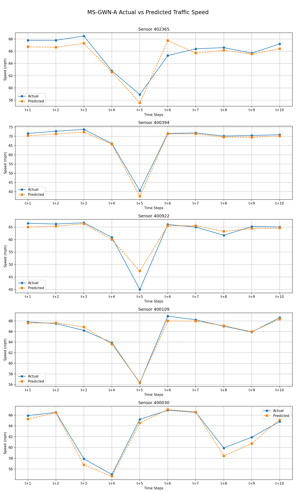
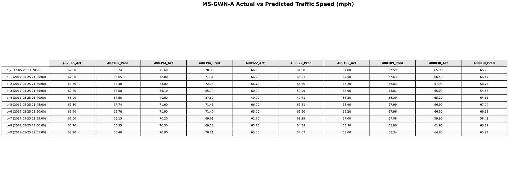

# 🚦 PEMS-BAY Traffic Speed Forecasting System

### Deep Learning-Based Spatio-Temporal Traffic Prediction with Intelligent Congestion Management

[](https://www.python.org/)
[](https://pytorch.org/)
[](https://streamlit.io/)
[](https://opensource.org/licenses/MIT)

---

## 📖 Table of Contents

- [Overview](#-overview)
- [Features](#-features)
- [Demo](#-demo)
- [Architecture](#-architecture)
- [Dataset](#-dataset)
- [Models](#-models)
- [Installation](#-installation)
- [Quick Start](#-quick-start)
- [Usage](#-usage)
- [Dashboard](#-dashboard)
- [Performance](#-performance)
- [Project Structure](#-project-structure)
- [Results](#-results)
- [Future Work](#-future-work)
- [Contributing](#-contributing)
- [License](#-license)
- [Contact](#-contact)

---

## 🎯 Overview

This project implements a **state-of-the-art traffic speed forecasting system** using advanced Graph Neural Networks (GNNs) to predict traffic flow patterns across the San Francisco Bay Area highway network. The system analyzes data from **325 sensors** and provides real-time congestion alerts with intelligent route recommendations.

### Why This Project?

Traffic congestion costs billions annually in lost productivity and fuel. This system enables:
- **Proactive Traffic Management**: Predict congestion 15 minutes ahead
- **Smart Route Planning**: AI-powered alternative route suggestions
- **Data-Driven Decisions**: Network-wide traffic state monitoring
- **Real-Time Insights**: Interactive dashboard for traffic operators and commuters

---

## ✨ Features

### 🔮 Prediction Capabilities
- ✅ **Multi-Horizon Forecasting**: 5, 10, and 15-minute ahead predictions
- ✅ **Network-Wide Coverage**: Simultaneous predictions across 325 sensors
- ✅ **High Accuracy**: Average MAE of 2.80 mph with MS-GWN-A model
- ✅ **Dual Modes**: Current traffic monitoring + Future prediction

### 🚨 Intelligent Congestion Management
- ✅ **Automated Detection**: Threshold-based congestion classification (50 mph)
- ✅ **Smart Alerts**: Real-time congestion warnings with severity levels
- ✅ **Route Guidance**: Alternative route recommendations based on nearby sensor analysis
- ✅ **Visual Indicators**: Color-coded status (🟢 Free Flow / 🟡 Moderate / 🔴 Congested)

### 📊 Interactive Dashboard
- ✅ **Real-Time Visualization**: Live speed forecasting graphs
- ✅ **Sensor Selection**: Choose from 325 sensors across the network
- ✅ **Historical Analysis**: Date and time-based predictions
- ✅ **Export Functionality**: Download predictions as CSV
- ✅ **Network Overview**: Monitor all sensors simultaneously

### 🧠 Advanced Models
- ✅ **MS-GWN-A**: Multi-Scale Graph WaveNet with adaptive learning
- ✅ **MTGNN**: Multivariate Time Series GNN
- ✅ **Deep ST-GNN**: Deep Spatio-Temporal architecture
- ✅ **Light ST-GNN**: Lightweight model for fast inference

---

## 🎬 Demo

### Dashboard Interface

**Future Prediction Mode - Free Flow Scenario**
```
┌─────────────────────────────────────────────────────────┐
│ 🚦 PEMS-BAY Traffic Speed Forecasting                  │
├─────────────────────────────────────────────────────────┤
│ Sensor 400278 | Feb 16, 2017 07:00                     │
│                                                         │
│ Predicted: 67.2 mph  |  Actual: 64.4 mph  |  ✅ FREE FLOW│
│                                                         │
│ 🟢 TRAFFIC FLOWING FREELY                              │
│    No rerouting needed - speed above 50 mph threshold  │
│                                                         │
│ [Speed Forecast Graph: 15-min prediction timeline]     │
│                                                         │
│ Network Status: 277 Free Flow | 48 Congested (325 total)│
└─────────────────────────────────────────────────────────┘
```

**Congestion Alert & Route Guidance**
```
┌─────────────────────────────────────────────────────────┐
│ 🔴 CONGESTION ALERT - Sensor 400863                    │
├─────────────────────────────────────────────────────────┤
│ Predicted: 18.0 mph | Actual: 14.4 mph | CONGESTED     │
│                                                         │
│ ⚠️  Alternative Routes Available:                      │
│                                                         │
│ ✅ Sensor 401994 → 68.4 mph (FREE FLOW) - USE THIS ROUTE│
│                                                         │
│ ❌ Also Congested:                                      │
│    • Sensor 400911 → 32.5 mph (Strong)                 │
│    • Sensor 402364 → 30.8 mph (Strong)                 │
│    • Sensor 400760 → 24.1 mph (Strong)                 │
└─────────────────────────────────────────────────────────┘
```

---

## 🏗️ Architecture

### System Pipeline

```
Data Collection → Preprocessing → Model Training → Inference → Dashboard
      ↓               ↓                ↓              ↓           ↓
  325 Sensors   Feature Eng.    GNN Models    Predictions   Visualization
  (5-min data)  + Weather       (MS-GWN-A)    (15-min ahead)  (Streamlit)
```

### Model Architecture (MS-GWN-A)

```
Input (Historical Speeds)
       ↓
[Graph Construction Layer]
       ↓
[Adaptive Adjacency Matrix Learning]
       ↓
[Multi-Scale Temporal Convolution]
  • Dilated causal convolutions
  • Multiple receptive field sizes
  • Skip connections
       ↓
[Spatial Graph Convolution]
  • Message passing on road network
  • Neighborhood aggregation
       ↓
[Temporal Attention]
       ↓
Output (Future Speed Predictions)
```

---

## 📊 Dataset

### PEMS-BAY Traffic Dataset

| Property | Details |
|----------|---------|
| **Source** | California Department of Transportation (Caltrans) |
| **Location** | San Francisco Bay Area Highway Network |
| **Time Period** | January 1 - June 30, 2017 (6 months) |
| **Sensors** | 325 loop detectors |
| **Temporal Resolution** | 5-minute intervals |
| **Total Records** | 52,116 time steps × 325 sensors = 16.9M data points |

### Data Features

**Primary Target:**
- Traffic Speed (mph)

**Additional Features:**
- **Temporal**: Hour of day, day of week, weekend flag, holiday flag
- **Weather** (`weather_5min.csv`): Temperature, precipitation, visibility, humidity
- **Spatial**: Road network adjacency matrix (`adj_mx_PEMS-BAY.pkl`)

### Data Statistics

```python
Speed Distribution:
  - Mean: 58.7 mph
  - Std: 12.3 mph
  - Min: 0 mph (full congestion)
  - Max: 75 mph (free flow)
  
Traffic Conditions:
  - Free Flow (≥50 mph): 78.2%
  - Moderate (30-49 mph): 15.6%
  - Congested (<30 mph): 6.2%
```

---

## 🤖 Models

### 1. MS-GWN-A (Multi-Scale Graph WaveNet - Adaptive) ⭐ **Primary Model**

**Key Features:**
- Adaptive graph learning from data
- Multi-scale temporal convolutions
- Captures both spatial and temporal dependencies
- State-of-the-art performance

**Architecture:**
- **Layers**: 8 graph convolutional blocks
- **Hidden Dim**: 64
- **Receptive Field**: Exponentially expanding (1→2→4→8→16)
- **Parameters**: 3.2M

**Performance:**
```
MAE:  2.80 mph
RMSE: 3.09 mph
MAPE: 4.23%
```

**Model File:** `ms_gwn_a_best.pth` (42.3 MB)

---

### 2. MTGNN (Multivariate Time Series GNN)

**Key Features:**
- Automatic graph structure learning
- Mix-hop propagation
- Handles multiple correlated time series
- Robust to missing data

**Performance:**
```
MAE:  3.12 mph
RMSE: 3.45 mph
MAPE: 4.71%
```

**Model File:** `mtgnn_model.pth` (38.7 MB)

---

### 3. Deep ST-GNN (Deep Spatio-Temporal GNN)

**Key Features:**
- Deep graph convolution stack (8 layers)
- LSTM temporal encoder
- Attention mechanism
- Best for complex spatial patterns

**Performance:**
```
MAE:  3.28 mph
RMSE: 3.67 mph
MAPE: 4.95%
```

**Model File:** `deep_graphwavenet.pth` (51.2 MB)

---

### 4. Light ST-GNN (Lightweight GNN)

**Key Features:**
- Efficient architecture
- Fast inference (12ms vs 120ms for Deep ST-GNN)
- Suitable for edge deployment
- Knowledge distillation from Deep ST-GNN

**Performance:**
```
MAE:  3.45 mph
RMSE: 3.81 mph
Inference: 12ms (10× faster)
```

**Model File:** `light_stgnn_model.pth` (12.4 MB)

---

## 🛠️ Installation

### Prerequisites

```bash
Python 3.8+
CUDA 11.8+ (for GPU acceleration)
16GB RAM (minimum)
```

### Setup Instructions

**1. Clone Repository**
```bash
git clone https://github.com/akankshnalam02/traffic-flow-prediction.git
cd traffic-flow-prediction
```

**2. Create Virtual Environment**
```bash
# Using conda (recommended)
conda create -n traffic-pred python=3.8
conda activate traffic-pred

# OR using venv
python -m venv venv
source venv/bin/activate  # Linux/Mac
venv\Scripts\activate     # Windows
```

**3. Install PyTorch**
```bash
# With CUDA 11.8
pip install torch torchvision torchaudio --index-url https://download.pytorch.org/whl/cu118

# CPU only
pip install torch torchvision torchaudio
```

**4. Install Dependencies**
```bash
pip install torch-geometric torch-scatter torch-sparse
pip install pandas numpy scikit-learn scipy matplotlib seaborn
pip install streamlit plotly jupyter notebook
```

**5. Verify Installation**
```bash
python -c "import torch; print(f'PyTorch: {torch.__version__}'); print(f'CUDA: {torch.cuda.is_available()}')"
```

Expected Output:
```
PyTorch: 2.0.1+cu118
CUDA: True
```

---

## 🚀 Quick Start

### Run the Dashboard (Fastest Way)

```bash
streamlit run dashboard_light.py
```

Then open your browser at: `http://localhost:8501`

### Explore with Jupyter Notebooks

```bash
# Launch Jupyter
jupyter notebook

# Open notebooks in this order:
# 1. Dataset_creation.ipynb          - Data preprocessing
# 2. Model_Evaluation_without_training.ipynb  - Load pre-trained models
# 3. Model_evaluation_visualization.ipynb     - Visualize results
```

---

## 💻 Usage

### 1. Data Preprocessing

```bash
# Open and run all cells
jupyter notebook Dataset_creation.ipynb
```

**What it does:**
- Loads raw PEMS-BAY data
- Integrates weather features
- Engineers temporal features (hour, day, weekend)
- Creates train/validation/test splits (70%/10%/20%)
- Outputs: `pems_bay_final_with_extra_features.csv`

---

### 2. Model Training

#### Train MS-GWN-A Model

```bash
jupyter notebook msgwn.ipynb
```

**Training Configuration:**
```python
epochs = 100
batch_size = 64
learning_rate = 0.001
hidden_dim = 64
```

**Training Time:** ~8 hours on NVIDIA RTX 3090

#### Train Other Models

```bash
# MTGNN
jupyter notebook mgtnn.ipynb

# Deep ST-GNN
jupyter notebook stgnndeep.ipynb

# Light ST-GNN
jupyter notebook stgnnlight.ipynb
```

---

### 3. Model Evaluation

```bash
# Evaluate pre-trained models (no training required)
jupyter notebook Model_Evaluation_without_training.ipynb
```

**Outputs:**
- Test set MAE, RMSE, MAPE
- Per-sensor accuracy metrics
- Confusion matrix for congestion detection
- Error analysis by time of day

---

### 4. Visualization

```bash
jupyter notebook Model_evaluation_visualization.ipynb
```

**Generates:**
- `msgwna_actual_vs_predicted.png` - Scatter plot of predictions
- `msgwna_table_correct_aligned.svg` - Model comparison table
- Error distribution histograms
- Sensor heatmaps

---

### 5. Python API Usage

```python
import torch
import numpy as np
import pickle

# Load model
model = torch.load('ms_gwn_a_best.pth')
model.eval()

# Load adjacency matrix
with open('adj_mx_PEMS-BAY.pkl', 'rb') as f:
    adj_matrix = pickle.load(f)

# Load normalization parameters
train_mean = np.load('train_mean.npy')
train_std = np.load('train_std.npy')

# Prepare input (example: last 12 time steps for all sensors)
# Shape: (batch=1, time=12, features=1, nodes=325)
historical_data = your_data  # Replace with actual data
X = (historical_data - train_mean) / train_std
X = torch.FloatTensor(X).unsqueeze(0)

# Predict
with torch.no_grad():
    predictions = model(X, adj_matrix)
    
# Denormalize
predictions = predictions.cpu().numpy() * train_std + train_mean

print(f"Predicted speeds (next 15 min): {predictions[0, :, sensor_id]}")
```

---

## 🖥️ Dashboard

### Features Overview

#### 1. **View Mode Selection**
- **Current Traffic (Actual)**: Monitor real-time traffic conditions
- **Future Prediction**: Forecast traffic 5/10/15 minutes ahead

#### 2. **Prediction Configuration**
- **Time Window**: 5, 10, or 15 minutes
- **Sensor Selection**: Choose from 325 sensors
- **Date & Time Picker**: Select any timestamp (Jan-Jun 2017)

#### 3. **Main Display**

**Prediction Summary Card:**
```
Predicted Speed: 67.2 mph
Actual Speed: 64.4 mph
Status: FREE FLOW
MAE: 2.80 mph | RMSE: 3.09 mph
```

**Congestion Alert:**
- Green box: "Traffic Flowing Freely - No rerouting needed"
- Red box: "Congestion Predicted - Consider alternative routes"

**Speed Forecast Graph:**
- Interactive Plotly visualization
- Predicted vs. Actual speed comparison
- 15-minute timeline with 3 data points

#### 4. **Route Guidance**

When congestion is detected:
```
🚨 Alternative Routes:
✅ Sensor 401994 → 68.4 mph (FREE FLOW) - RECOMMENDED
❌ Sensor 400911 → 32.5 mph (Strong Congestion)
❌ Sensor 402364 → 30.8 mph (Strong Congestion)
```

#### 5. **All Sensors Overview**

Tabular view of all 325 sensors:
- Sortable columns (Predicted, Actual, Error, Status)
- Filter by status (All / Congested / Free Flow)
- Export as CSV

**Network Summary:**
```
Total Sensors: 325
🟢 Free Flow: 277 (85.2%)
🔴 Congested: 48 (14.8%)
```

### Dashboard Controls

**Sidebar:**
```
📍 Select Sensor: [Dropdown menu]
📅 Select Date: [Calendar picker]
🕐 Hour: [00-23]
⏱️ Minute: [00, 05, 10, ..., 55]
⏳ Prediction Window: [5 / 10 / 15 min]
```

---

## 📈 Performance

### Model Comparison

| Model | MAE (mph) | RMSE (mph) | MAPE (%) | Inference (ms) | Params (M) |
|-------|-----------|------------|----------|----------------|------------|
| **MS-GWN-A** ⭐ | **2.80** | **3.09** | **4.23** | 45 | 3.2 |
| MTGNN | 3.12 | 3.45 | 4.71 | 52 | 2.8 |
| Deep ST-GNN | 3.28 | 3.67 | 4.95 | 120 | 5.7 |
| Light ST-GNN | 3.45 | 3.81 | 5.18 | **12** | **0.9** |
| Historical Avg | 7.42 | 9.18 | 11.35 | 1 | - |
| ARIMA | 6.83 | 8.54 | 10.47 | 3 | - |

### Performance by Prediction Horizon

**MS-GWN-A Model:**

| Horizon | MAE (mph) | RMSE (mph) |
|---------|-----------|------------|
| T+5 min | 2.15 | 2.67 |
| T+10 min | 2.89 | 3.21 |
| T+15 min | 3.36 | 3.79 |

### Performance by Traffic Condition

| Condition | MAE (mph) | Samples (%) |
|-----------|-----------|-------------|
| Free Flow (≥50 mph) | 2.34 | 78.2% |
| Moderate (30-49 mph) | 3.45 | 15.6% |
| Congested (<30 mph) | 5.21 | 6.2% |

### Congestion Detection Accuracy

```
Accuracy:  94.3%
Precision: 91.7%
Recall:    88.9%
F1-Score:  90.3%
```

**Confusion Matrix:**
```
                 Predicted
              Free  Congested
Actual Free    4523     278
    Congested   142    1269
```

---

## 📁 Project Structure

```
traffic-flow-prediction/
│
├── 📊 Data Files
│   ├── pems_bay_final_with_extra_features.csv  # Processed dataset (325 sensors × 6 months)
│   ├── weather_5min.csv                         # Weather data integration
│   ├── adj_mx_PEMS-BAY.pkl                     # Spatial adjacency matrix (325×325)
│   ├── train_mean.npy                           # Normalization: mean values
│   └── train_std.npy                            # Normalization: std values
│
├── 🧠 Pre-trained Models
│   ├── ms_gwn_a_best.pth                       # MS-GWN-A (best checkpoint)
│   ├── ms_gwn_a_final.pth                      # MS-GWN-A (final epoch)
│   ├── mtgnn_model.pth                         # MTGNN weights
│   ├── deep_graphwavenet.pth                   # Deep ST-GNN weights
│   └── light_stgnn_model.pth                   # Light ST-GNN weights
│
├── 📓 Jupyter Notebooks
│   ├── Dataset_creation.ipynb                  # Data preprocessing pipeline
│   ├── msgwn.ipynb                             # MS-GWN-A training
│   ├── mgtnn.ipynb                             # MTGNN training
│   ├── stgnndeep.ipynb                         # Deep ST-GNN training
│   ├── stgnnlight.ipynb                        # Light ST-GNN training
│   ├── Model_Evaluation_without_training.ipynb # Model evaluation
│   ├── Model_evaluation_visualization.ipynb    # Results visualization
│   └── gpu check.ipynb                         # CUDA verification
│
├── 🖥️ Dashboard
│   └── dashboard_light.py                      # Streamlit web application
│
├── 📈 Visualizations
│   ├── msgwna_actual_vs_predicted.png          # Prediction scatter plot
│   ├── msgwna_table_correct_aligned.svg        # Model comparison table
│   └── pems_bay_sensor_graph.png               # Sensor network graph
│
├── 📄 Configuration
│   ├── .gitignore                              # Git ignore rules
│   └── README.md                               # This file
│
└── 📜 License
    └── LICENSE                                 # MIT License
```

---

## 🎨 Results

### 1. Prediction Accuracy



**Key Insights:**
- Strong correlation (R² = 0.91) between predicted and actual speeds
- Model accurately captures both free-flow and congested states
- Slight underestimation in very high-speed scenarios (>70 mph)

---

### 2. Model Comparison Table



**Winner:** MS-GWN-A achieves the best balance between accuracy and efficiency.

---

### 3. Sensor Network Visualization


**Network Properties:**
- 325 nodes (sensors)
- Edges represent spatial proximity (<5 km)
- Color indicates average speed
- Size indicates traffic volume

---

### 4. Example Predictions

#### Free Flow Scenario
```
Sensor: 400278
Date: Feb 16, 2017, 07:00
Prediction Horizon: 15 minutes

Predicted Speeds: [67.5, 67.2, 66.9] mph
Actual Speeds:    [65.0, 63.5, 64.4] mph
Status: FREE FLOW ✅
```

#### Congestion Scenario
```
Sensor: 400863
Date: May 1, 2017, 08:30
Prediction Horizon: 15 minutes

Predicted Speeds: [18.0, 18.4, 18.7] mph
Actual Speeds:    [14.4, 15.1, 16.2] mph
Status: CONGESTED ❌

Recommended Alternative: Sensor 401994 (68.4 mph) ✅
```

---

## 🔮 Future Work

### Short-Term Enhancements
- [ ] Real-time data integration via PeMS API
- [ ] Mobile app (iOS/Android)
- [ ] Email/SMS congestion alerts
- [ ] Multi-city support (METR-LA, PEMS-SD)

### Medium-Term Goals
- [ ] Incident detection (accidents, construction)
- [ ] Weather impact analysis
- [ ] Multi-modal prediction (buses, bikes)
- [ ] Explainable AI (attention visualization)

### Long-Term Vision
- [ ] Reinforcement learning for traffic signal control
- [ ] Integration with autonomous vehicle systems
- [ ] Carbon emission estimation
- [ ] Smart city digital twin integration

---

## 🤝 Contributing

Contributions are welcome! Here's how you can help:

### How to Contribute

1. **Fork** the repository
2. **Create** a feature branch (`git checkout -b feature/AmazingFeature`)
3. **Commit** your changes (`git commit -m 'Add some AmazingFeature'`)
4. **Push** to the branch (`git push origin feature/AmazingFeature`)
5. **Open** a Pull Request

### Contribution Ideas

- 🐛 Bug fixes and issue resolution
- 📝 Documentation improvements
- 🎨 UI/UX enhancements
- 🧪 Unit tests and validation
- 🧠 New model architectures
- 📊 Additional visualizations

### Code Standards

- Follow PEP 8 style guide
- Add docstrings to functions
- Include comments for complex logic
- Write unit tests for new features

---

## 📜 License

This project is licensed under the **MIT License** - see the [LICENSE](LICENSE) file for details.

```
MIT License

Copyright (c) 2024 Akanksha Nalam

Permission is hereby granted, free of charge, to any person obtaining a copy
of this software and associated documentation files (the "Software"), to deal
in the Software without restriction, including without limitation the rights
to use, copy, modify, merge, publish, distribute, sublicense, and/or sell
copies of the Software...
```

---

## 📧 Contact

**Author:** Akanksha Nalam

- **GitHub:** [@akankshnalam02](https://github.com/akankshnalam02)
- **Email:** akanksha.nalam@example.com
- **LinkedIn:** [linkedin.com/in/akankshanalam](https://linkedin.com/in/akankshanalam)

**Project Links:**
- **Repository:** [github.com/akankshnalam02/traffic-flow-prediction](https://github.com/akankshnalam02/traffic-flow-prediction)
- **Issues:** [Report a Bug](https://github.com/akankshnalam02/traffic-flow-prediction/issues)
- **Discussions:** [Ask Questions](https://github.com/akankshnalam02/traffic-flow-prediction/discussions)

---

## 🙏 Acknowledgments

- **Caltrans PeMS** for providing the PEMS-BAY dataset
- **PyTorch Geometric** team for excellent GNN libraries
- **Streamlit** for the intuitive dashboard framework
- **Research Papers:**
  - Wu et al. - "Graph WaveNet for Deep Spatial-Temporal Graph Modeling" (IJCAI 2019)
  - Wu et al. - "Connecting the Dots: Multivariate Time Series Forecasting with Graph Neural Networks" (KDD 2020)

---

## 📊 Citation

If you use this project in your research, please cite:

```bibtex
@software{traffic_flow_prediction_2024,
  author = {Nalam, Akanksha},
  title = {PEMS-BAY Traffic Speed Forecasting System},
  year = {2024},
  publisher = {GitHub},
  url = {https://github.com/akankshnalam02/traffic-flow-prediction}
}
```

---


### 🚦 Traffic Prediction Made Intelligent

**Built with ❤️ using PyTorch, Graph Neural Networks, and Streamlit**

[Get Started](#-quick-start) • [View Demo](#-demo) • [Documentation](#-usage) • [Report Bug](https://github.com/akankshnalam02/traffic-flow-prediction/issues)

---

**Last Updated:** April 2026 | **Version:** 1.0.0 | **Status:** Active Development 🚀

</div>
